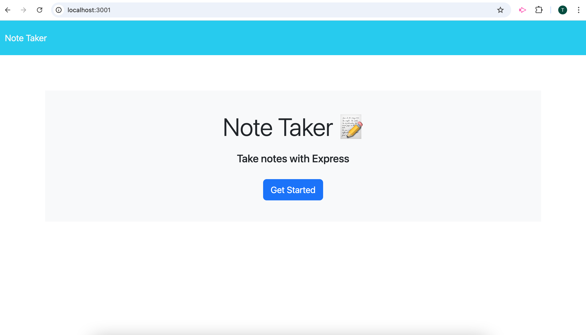
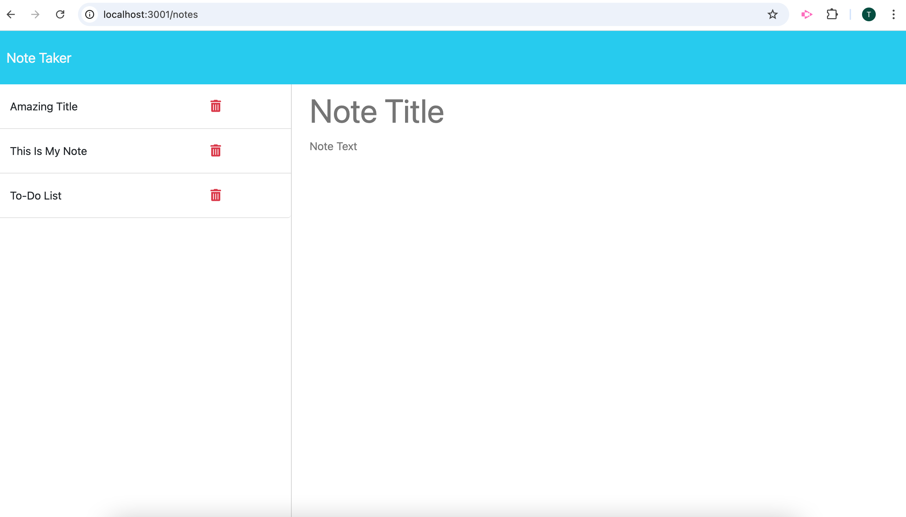
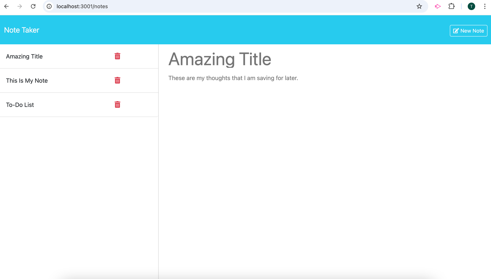

# Note Taker App

## Description
This project was created with the idea in mind that the user can write and save notes for their own personal use. The code utilizes Express.js and Node.js to properly run. The primary skill applied in the creation of this application was Express's routing system. This project was created using starter code.

## Usage
Clone code and run "npm install" in the terminal. Then enter "npm run start" to start the server. The application can now be run in your local browser. To close the server, enter "control c".

## License
MIT

## Web Link

## Screenshots

